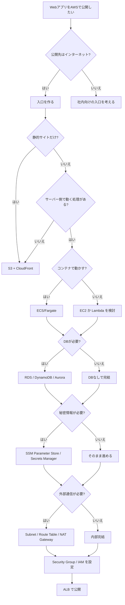

# AWSでWebアプリを公開するときの考え方メモ

今回のハンズオンでは、手順どおりに進めることで AWS の各サービスを触れた。  
ただ、実際には「Webアプリを公開したい」と考えたときに、どのサービスをどの順番で使うかを自分で整理する力が必要になる。

そのときは、いきなりサービス名を思い出すのではなく、まず要件を分解すると考えやすい。

## まず分けて考える項目

- 公開先はインターネットか、社内向けか
- 静的サイトか、サーバー処理のあるWebアプリか
- どこで動かすか
- データをどこに置くか
- 秘密情報をどう渡すか
- 外部通信が必要か
- どの権限で動かすか
- どう入口を作るか

## サービスを当てはめる流れ

### 1. 入口を決める

- インターネット公開なら ALB や CloudFront を考える
- 社内向けなら VPN や内部向けの入口を考える

### 2. 実行場所を決める

- 静的サイトなら S3 + CloudFront が候補になる
- 動的Webアプリなら ECS/Fargate、EC2、Lambda などを考える

### 3. 保存先を決める

- 画像やファイルなら S3
- テーブルデータなら RDS や DynamoDB

### 4. 秘密情報を決める

- DBパスワードやAPIキーは SSM Parameter Store や Secrets Manager に置く

### 5. 外部通信の経路を決める

- プライベートサブネットから外へ出るなら NAT Gateway を使う
- サブネットごとのルートテーブルを確認する

### 6. 権限を決める

- 誰が何にアクセスするかは IAM で決める
- どの通信を通すかは Security Group で決める

## 今回のハンズオンに当てはめると

- 入口: ALB
- 実行: ECS/Fargate
- 保存先: RDS PostgreSQL
- 秘密情報: SSM Parameter Store
- 配布: ECR
- 通信経路: VPC / Subnet / Route Table / NAT Gateway
- 通信制御: Security Group
- 権限: IAM

つまり、**Webアプリ公開は1つのサービスで完結するのではなく、入口・実行・保存・秘密・経路・権限を組み合わせて作る** ということになる。

## 判断の順番

迷ったら、次の順番で考えるとよい。

1. 何を公開したいか
2. どこで動かすか
3. 何を保存するか
4. 秘密情報があるか
5. 外部通信が必要か
6. どの権限で動かすか
7. どう入口を作るか

## 学び

- サービス名を覚えるだけでは足りない
- 要件を分解すると、必要なAWSサービスが見えてくる
- ハンズオンは「手順をなぞる練習」だが、実務では「必要な部品を選ぶ力」が必要になる
- まずは役割ごとに分けて考えると整理しやすい

## Webアプリ公開の簡易フローチャート

## ひとことで言うと

**「やりたいこと」を先に分解して、必要な役割ごとに AWS サービスを当てはめる。**

